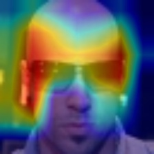
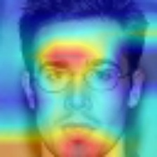

## dogs_cats
In this project, I applied GradCam methods (and a bit of LIME and SHAP methods) to understand the decisions of CNNs (including ResNet-18 and VGG19) in image classification. I started with a common example of using CNNs to classify "dogs" and "cats" on the dogs_chiens dataset. The models all demonstrated fairly accurate prediction capabilities (>90%) in classifying images of dogs and cats. 

Then, using GradCam, LIME, and SHAP methods, I was able to understand the important regions in the images that the models relied on to make their decisions.

    
    
    

As seen in the results above, the important regions are always focused on areas where dogs or cats appear. This helps us understand that the model has been well-trained and makes reliable predictions.

## celeb_A
After the success of GradCAM with the dogs_cats dataset, I started working with a more complex dataset, even though the models were already trained and provided fairly accurate classification predictions (>90%). However, the results obtained from GradCAM showed that the prediction results do not entirely depend on the position of the object in the image. I obtained some images as follows:

In the first example, the model predicted that the man was wearing glasses, and GradCAM performed relatively well by highlighting the area around the glasses. However, this area is quite broad and includes some unrelated regions. In the second image, the model predicted that the man was wearing glasses and smiling. It can be seen that the GradCAM areas are fairly close to those features in the image but not entirely accurate.

From this, we can raise some questions:

    
    
    

Why does the model perform well with GradCAM on the dogs_cats dataset compared to the celeb_A dataset, even though the predictions are fairly accurate?

Has the model been trained well enough to make accurate and justified predictions, even though the accuracy is already quite high?

Do the facial features have a certain level of correlation, and does this affect GradCAM's analysis capabilities?

...

